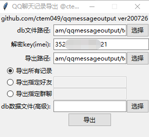

# qqmessageoutput

安卓QQ好友数据和聊天记录 解密并导出，基于[roadwide/qqmessageoutput](https://github.com/roadwide/qqmessageoutput)，gui参考了[Yiyiyimu/QQ_History_Backup](https://github.com/Yiyiyimu/QQ_History_Backup)。

可以一次性导出好友数据和所有聊天记录，如果数据较多，导出时请耐心等待。

# 1 本项目的使用方法

作为python库使用, 请参看c_use_example.py

GUI([GitHub下载](https://github.com/ctem049/qqmessageoutput/releases/download/1.0.200726/qex_v1.0.200726_win64.exe))使用：



选择db路径和导出路径，输入解密key(一般为imei)，获取方法可见下文。选择导出所有记录或者指定的好友/群聊。

db数据文件用于导出slowtable(*可留空不填*)，即db路径(第一项)选择`你的QQ.db`，db数据文件(最后一项)选择`slowtable_你的QQ.db`，即可导出`slowtable_你的QQ.db`中的聊天记录。

# 2 获取db的方法

默认路径:

```
data\data\com.tencent.mobileqq\databases\你的QQ.db
data\data\com.tencent.mobileqq\databases\slowtable_你的QQ.db
```

更多参考方法: https://www.cnblogs.com/roadwide/p/11220211.html

# 3 获取key的方法

key是解密的密钥，一般是手机序列号(imei)，拨号键盘下输入`*#06#`

部分新版qq的解密密钥则可能位于以下文件中

```
data\data\com.tencent.mobileqq\files\kc
```

手机QQ的db文件加密方式是异或加密，如果找不到自己的key可以反向破解:

```
key = 原文 XOR 密文
```
